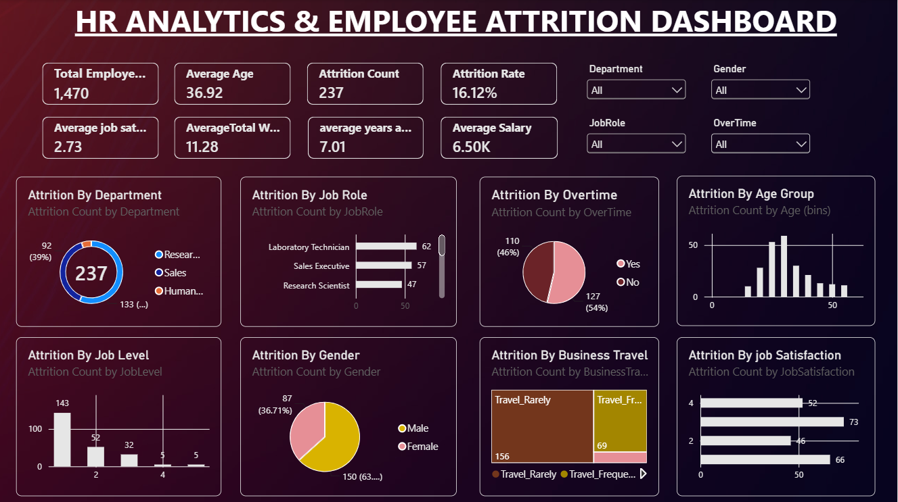

HR Analytics & Employee Attrition Dashboard

📊 Project Overview

This project analyzes employee data to understand employee attrition patterns and identify key areas that may require attention from HR teams.

An interactive dashboard was developed in Microsoft Power BI to provide insights across departments, job roles, job levels, age groups, overtime, job satisfaction, gender, and business travel.

🎯 Business Objective

The main objectives of this project are to:

* Analyze overall employee attrition.
* Identify departments and job roles with high attrition counts.
* Understand attrition patterns across different job levels and age groups.
* Analyze attrition across overtime, job satisfaction, gender, and business travel.
* Provide an interactive dashboard for HR-focused analysis.

🛠️ Tools & Technologies

* Power BI
* Excel
* DAX
* Data Cleaning
* Data Visualization
* Interactive Dashboard Development

📈 Key KPIs

KPI	Value
Total Employees	1,470
Attrition Count	237
Attrition Rate	16.12%
Average Age	36.92
Average Years at Company	7.01
Average Total Working Years	11.28
Average Job Satisfaction	2.73
Average Monthly Income	6.50K

🔍 Key Insights

* Job Level 1 contributes 60.3% of total attrition.
* Job Levels 1 and 2 together account for 82.3% of total attrition.
* Research & Development contributes 56.1% of total attrition.
* R&D and Sales together contribute approximately 94.9% of total attrition.
* Employees aged 25–34 contribute approximately 47.3% of total attrition.
* Laboratory Technicians have the highest attrition count among job roles.
* The top three roles — Laboratory Technician, Sales Executive, and Research Scientist — account for approximately 70% of total attrition.
* Employees working overtime account for 53.6% of total attrition.
* Travel_Rarely accounts for 65.8% of total attrition.

📊 Dashboard Features

The Power BI dashboard includes:

* KPI Cards
* Department-wise Attrition
* Job Role-wise Attrition
* Overtime-wise Attrition
* Age Group-wise Attrition
* Job Satisfaction-wise Attrition
* Gender-wise Attrition
* Job Level-wise Attrition
* Business Travel-wise Attrition
* Interactive slicers for:
    * Department
    * Overtime
    * Gender
    * Job Role

🧮 DAX Measures

The project uses DAX measures including:

* Total Employees
* Attrition Count
* Attrition Rate
* Average Age
* Average Monthly Income
* Average Years at Company
* Average Total Working Years
* Average Job Satisfaction

💡 Conclusion

The analysis indicates that employee attrition is concentrated in specific employee segments, particularly Job Level 1, R&D, and the 25–34 age group.

The dashboard provides an interactive way to explore these patterns and can help HR teams identify areas for deeper analysis and potential employee-retention initiatives.

⚠️ Note

The percentages presented in the insights represent the share of total attrition, not category-specific attrition rates. Category-specific attrition rates would require the total employee count for each category.

📁 Project Files

* Power BI Dashboard (.pbix)
* Dashboard Screenshot
* Project Documentation / README
* Dataset source/reference

👤 Author

Asif Khan

Aspiring Data Analyst | Power BI | Excel | SQL | Python
